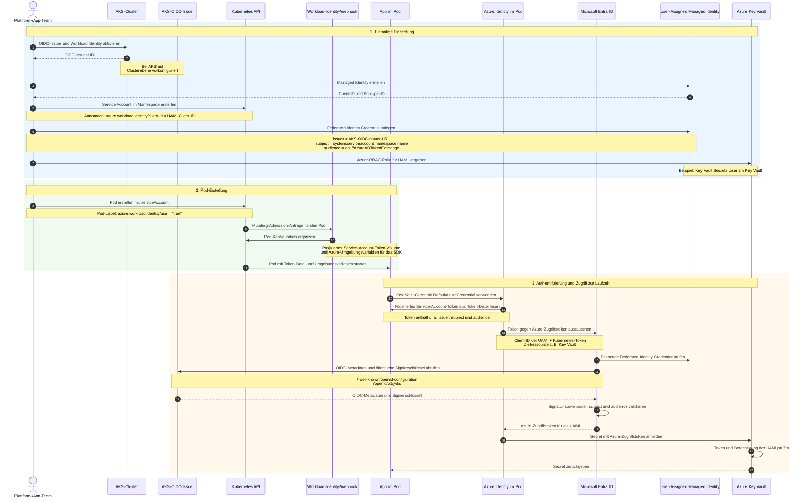

```mermaid
sequenceDiagram
    autonumber

    actor Admin as Plattform-/App-Team
    participant AKS as AKS-Cluster
    participant Issuer as AKS-OIDC-Issuer
    participant K8s as Kubernetes API
    participant Webhook as Workload-Identity-Webhook
    participant Pod as App im Pod
    participant SDK as Azure.Identity im Pod
    participant Entra as Microsoft Entra ID
    participant UAMI as User-Assigned Managed Identity
    participant KV as Azure Key Vault

    rect rgb(235, 245, 255)
        Note over Admin,KV: 1. Einmalige Einrichtung
        Admin->>AKS: OIDC-Issuer und Workload Identity aktivieren
        AKS-->>Admin: OIDC-Issuer-URL
        Note over AKS,Issuer: Bei AKS auf<br/>Clusterebene vorkonfiguriert

        Admin->>UAMI: Managed Identity erstellen
        UAMI-->>Admin: Client-ID und Principal-ID

        Admin->>K8s: Service Account im Namespace erstellen
        Note over Admin,K8s: Annotation: azure.workload.identity/client-id = UAMI-Client-ID

        Admin->>UAMI: Federated Identity Credential anlegen
        Note over Admin,UAMI: issuer = AKS-OIDC-Issuer-URL<br/>subject = system:serviceaccount:namespace:name<br/>audience = api://AzureADTokenExchange

        Admin->>KV: Azure-RBAC-Rolle für UAMI vergeben
        Note over UAMI,KV: Beispiel: Key Vault Secrets User am Key Vault
    end

    rect rgb(240, 250, 240)
        Note over Admin,Pod: 2. Pod-Erstellung
        Admin->>K8s: Pod erstellen mit serviceAccount
        Note over Admin,K8s: Pod-Label: azure.workload.identity/use = "true"
        K8s->>Webhook: Mutating-Admission-Anfrage für den Pod
        Webhook->>K8s: Pod-Konfiguration ergänzen
        Note over Webhook,Pod: Projiziertes Service-Account-Token-Volume<br/>und Azure-Umgebungsvariablen für das SDK
        K8s->>Pod: Pod mit Token-Datei und Umgebungsvariablen starten
    end

    rect rgb(255, 248, 235)
        Note over Pod,KV: 3. Authentifizierung und Zugriff zur Laufzeit
        Pod->>SDK: Key-Vault-Client mit DefaultAzureCredential verwenden
        SDK->>Pod: Föderiertes Service-Account-Token aus Token-Datei lesen
        Note over Pod,SDK: Token enthält u. a. issuer, subject und audience

        SDK->>Entra: Token gegen Azure-Zugriffstoken austauschen
        Note over SDK,Entra: Client-ID der UAMI + Kubernetes-Token<br/>Zielressource z. B. Key Vault

        Entra->>UAMI: Passende Federated Identity Credential prüfen
        Entra->>Issuer: OIDC-Metadaten und öffentliche Signierschlüssel abrufen
        Note over Issuer,Entra: /.well-known/openid-configuration<br/>/openid/v1/jwks
        Issuer-->>Entra: OIDC-Metadaten und Signierschlüssel
        Entra->>Entra: Signatur sowie issuer, subject und audience validieren
        Entra-->>SDK: Azure-Zugriffstoken für die UAMI

        SDK->>KV: Secret mit Azure-Zugriffstoken anfordern
        KV->>KV: Token und Berechtigung der UAMI prüfen
        KV-->>Pod: Secret zurückgeben
    end
```
